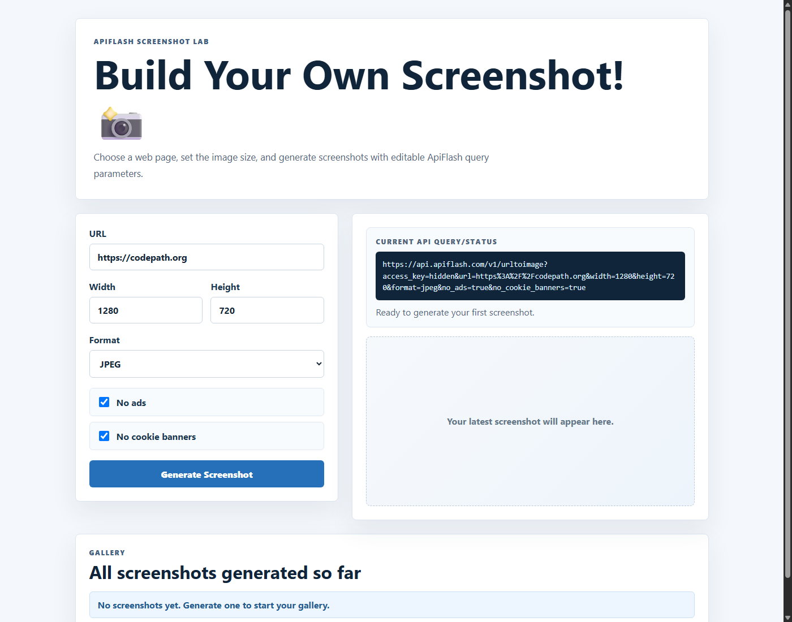

# WEB102 Unit 4 Lab: Cap

Submitted by: **Sabiu**

Build Your Own Screenshot! is a React + Vite app that uses the ApiFlash API to generate screenshots from user-selected query parameters.

Time spent: **TBD** hours spent in total

## Required Features

The following **required** functionality is completed:

- [x] The app uses the ApiFlash API.
- [x] The app makes an API call using `async/await`.
- [x] The app saves API results with `useState`.
- [x] The user can edit at least 3 query parameters.
- [x] The user can edit URL, width, height, format, no ads, and no cookie banners.
- [x] The returned screenshot is displayed on the page.
- [x] All screenshots generated so far are displayed in a gallery.
- [x] The ApiFlash access key is loaded from `.env` and is not hardcoded into committed source code.

The following **stretch** features are implemented:

- [x] Custom CSS styling is added.

## Screenshot

## Video Walkthrough

TODO: Add Loom walkthrough link after recording.

## Notes

- The local `.env` file contains `VITE_APIFLASH_ACCESS_KEY` and is ignored by git.
- The committed `.env.example` file documents the required environment variable.

## License

Copyright 2026 Sabiu

Licensed under the Apache License, Version 2.0.
